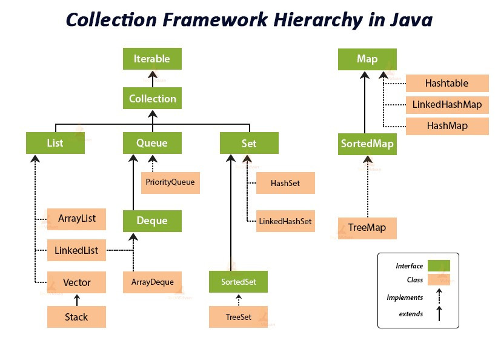

# 🧱 Stack & Queue 基礎總覽

## 📌 Stack（堆疊）

- 特性： LIFO（後進先出）
    ```
        +-------+
        |   3   |  <-- top (最後進來的元素，最先被移除)
        +-------+
        |   2   |
        +-------+
        |   1   |  <-- bottom (最早進來的元素，最後才被移除)
        +-------+
    ```

- 常見操作：
    - `push(x)`：將元素加入頂端
    - `pop()`：移除頂端元素
    - `top()`/`peek()`：查看頂端元素
    - `isEmpty()`：是否為空堆疊

- 應用場景：
    - 括號匹配（valid parentheses）
    - 反轉字串或數列
    - 模擬遞迴（DFS）
    - 單調堆疊（monotonic stack）處理最大區間問題（例：Largest Rectangle in Histogram）

### Stack 在 Java 中的實作

- Java 中 `Stack` 是一個**類別**：`java.util.Stack`

- `Stack` 是 `Vector` 的子類，是一種容器類型。
- 因此：效能差、不推薦使用
    - 原因：`Vector` 是同步的，額外的鎖影響效率
    - 官方檔案中建議使用非同步的 `Deque`（如 `ArrayDeque`）來實作 `Stack`

- `Stack` 屬於 `List` 介面的延伸（因為繼承自 `Vector`），提供迭代功能

- 基本操作：
  ```
  Deque<Integer> stack = new ArrayDeque<>();
  stack.push(1);      // 相當於加入頂端
  stack.pop();        // 移除頂端
  stack.peek();       // 查看頂端元素
  ```

--- 

## 📌 Queue（佇列）

- 特性： FIFO（先進先出）
    ```
    Front -->  [1] [2] [3]  <-- Rear
    ↑
    先進的元素最早被移除
    ```

- 常見操作：
    - `offer(x)`/`enqueue(x)`：加入尾端
    - `poll()`/`dequeue()`：移除前端元素
    - `peek()`：查看前端元素
    - `isEmpty`()：是否為空佇列

- 應用場景：
    - 層序迭代（BFS）
    - 實作 Cache（如 LRU）
    - 模擬排隊或資源處理

### Queue 在 Java 中的實作

- Java 的 `Queue` 是一個**介面**：`java.util.Queue`

- 不支援 iterator 來隨意迭代內容
    - 因為它是設計為 FIFO，強調順序性和限制性存取

  - 主要有以下實作：
  
  | 類別                      | 特點                  |
  |-------------------------|---------------------|
  | `LinkedList`            | 最常用，一般 Queue 實作     |
  | `ArrayDeque`            | 高效能、非同步、無鎖、**推薦使用** |
  | `PriorityQueue`         | 小頂堆（Heap）結構，用於排序    |
  | `ConcurrentLinkedQueue` | 多執行緒環境下使用           |

- 基本操作：
  ```
  Queue<Integer> queue = new LinkedList<>();
  queue.offer(1);    // 加入尾端
  queue.poll();      // 移除頭部
  queue.peek();      // 查看頭部元素
  ```

--- 

## 🔁 Deque（雙端佇列）

- 特性：兩端都能加/移元素（封一端變 Stack，開兩端變 Queue）

- 應用場景：
    - 滑動視窗最大值（Sliding Window Maximum）
    - 單調佇列（Monotonic Queue）
    - 用來實作 Stack 或 Queue（效率更好）

### Deque 在 Java 中的實作

- Java 的 `Deque`是一個**介面**：`java.util.Deque`
- 常用實作為 `ArrayDeque`，它可以同時用來當作：
    - Stack（使用 push() 和 pop()）
    - Queue（使用 offer() 和 poll()）

- 基本操作：
  ```
    Deque<Integer> deque = new ArrayDeque<>();
    deque.offerFirst(1); // 頭部加入
    deque.offerLast(2);  // 尾部加入
    deque.pollFirst();   // 頭部移除
    deque.pollLast();    // 尾部移除
  ```

---

## ❓Java 中 Stack 與 Queue 的底層實現

以下是一些關於 Java 中 Stack / Queue 的深度問題，建議在實作 LeetCode 題目前先思考：

1. Java 中的 Stack 是容器嗎？
    - 容器（Container） 就是用來裝資料的資料結構。它們的用途就是「存放」、「管理」和「操作」一群物件。
    - `Stack` 繼承自 `Vector`，而 `Vector` 是 `List` 的一種實作，而 `List` 是容器介面的一種。因此：
    - ✅ `Stack` 是 Java 中的一種容器，具備基本儲存與操作資料的能力。
2. Stack / Queue 是 Java 標準類庫的一部分還是額外引入？
   - Java 標準類庫，也稱為 Java API(Application Programming Interface)，其中常用的包含 `java.util` 套件。
   - ✅ 是 **Java 標準類庫**的一部分，包含在 `java.util` 套件中，無需額外引入第三方函式庫即可使用。
3. Java 中的 Stack / Queue 是怎麼實作的？底層結構是什麼？
   - 看下表
4. Stack / Queue 是否支援用 iterator 迭代內容？
   - 看下表

### Java Collection Framework UML 關係圖


### 底層實作的比較

| 類別／介面           | 是否支援迭代器 | 是否同步 | 底層結構              | 備註                                                              |
|-----------------|---------|------|-------------------|-----------------------------------------------------------------|
| `Stack`         | ✅       | ✅    | 動態陣列（來自 `Vector`） | 同步、效能差、已過時，建議使用 `ArrayDeque` 取代                                 |
| `Queue` 介面      | ✅ (⚠️)  | ❌    | -（介面）             | FIFO 抽象介面，本身僅定義操作行為；常見實作如 `LinkedList`、`PriorityQueue`          |
| `Deque` 介面      | ✅       | ❌    | -（介面）             | 雙端佇列介面，可從兩端操作；常見實作如 `ArrayDeque`、`LinkedList`                   |
| `Vector`        | ✅       | ✅    | 動態陣列              | 所有方法皆同步（用 `synchronized` 修飾），效能差，已過時                            |
| `LinkedList`    | ✅       | ❌    | 雙向鏈結串列            | 同時實作 `List`、`Deque`、`Queue`；插入刪除快但查找慢，適合做 Queue 使用              |
| `ArrayDeque`    | ✅       | ❌    | 環狀動態陣列            | 效能佳、無容量限制，不支援 `null` 元素；建議取代 `Stack` 和 `LinkedList` 作為佇列用途      |
| `PriorityQueue` | ✅ (⚠️)  | ❌    | 最小堆（Heap，陣列實作）    | 元素依自然順序或比較器排序，**迭代順序 ≠ 插入順序 ≠ 排序順序**，**不保證 FIFO**，不支援 `null` 元素 |

- ⚠️ `Queue` 支援迭代器
  - `Queue` 繼承自 `Collection` → `Iterable`，可支援迭代器。
  - 但是實作上迭代順序不符合插入順序或使用意圖（FIFO），所以不推薦拿來迭代作處理邏輯。
- ⚠️ `PriorityQueue` 支援迭代器
  - 可使用 iterator() 迭代。 
  - 但是順序並非元素大小順序（heap 是 partial order），是依自然順序或比較器排序。

###  Java 與 C++ STL 的對比思考
| 概念       | C++ STL（SGI STL）      | Java Collection Framework   |
|----------|-----------------------|-----------------------------|
| Stack 類別 | `std::stack`（adapter） | `Stack` / `Deque`（容器實作）     |
| Queue 類別 | `std::queue`（adapter） | `Queue`（介面）＋多種實作類別          |
| 底層預設結構   | `deque`               | `LinkedList` / `ArrayDeque` |
| 是否可迭代    | ❌ 否（stack/queue）      | ✅ 是（Stack / LinkedList）     |
| 是否同步     | ❌ 否                   | Stack ✅（同步）、Deque ❌（非同步）    |

- `Stack` 與 `Queue` 都是**容器的包裝結構**
    - `Stack` 是基於 `Vector` 實作
    - `Queue` 多基於 `LinkedList` 或 `ArrayDeque`
- 類似 C++ 的「container adapter」，Java 通常也是**依賴底層容器實作對外 API**

--- 

## 結論

- Java 中的 Stack / Queue 為標準類庫，可直接使用
- `Stack` 類基於 `Vector`，同步但效能差，不建議使用
- 建議使用 `ArrayDeque` 實作 `Stack` 或 `Queue`，更有效率
- `Queue` 是介面，由多種實作類別提供具體功能，依需求選擇底層結構
- 是否可迭代取決於底層結構與介面設計（`LinkedList` 可，`Queue`/`Deque` 通常不建議）
- Java 中的棧與佇列依賴集合框架，不像 C++ 有明確 adapter 分類
- 推薦用法：
    - `ArrayDeque` 替代 `Stack` 實作 Stack 行為
    - `ArrayDeque` 或 `LinkedList` 實作 Queue 行為
- 熟悉其底層實作（如 `Array` vs `LinkedList`）有助於優化效能與選擇正確工具