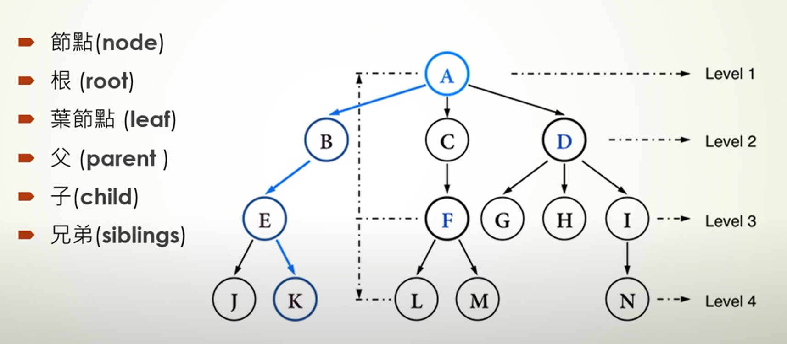
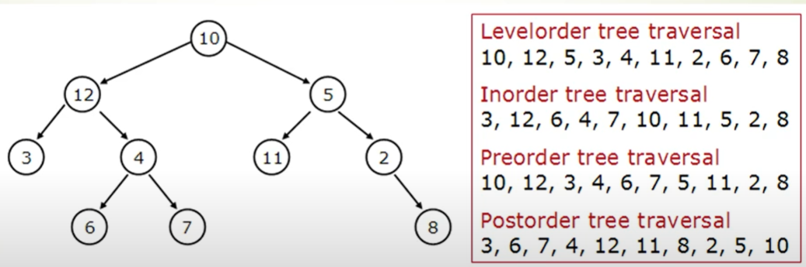
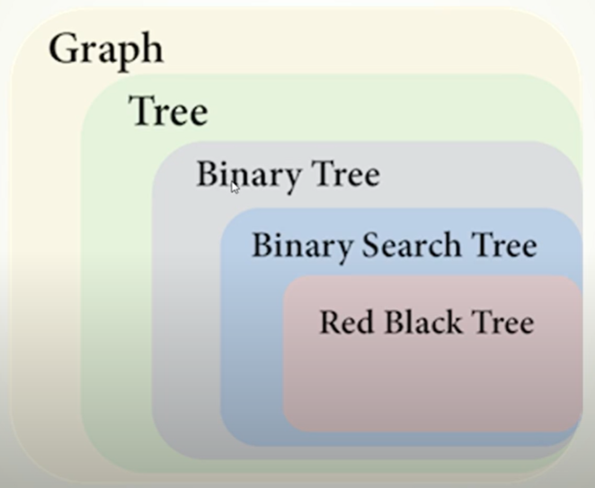
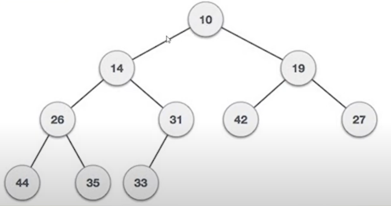

# 🌳 樹（Tree）

## 一、樹的基本結構
```
        A        (Level 1)
       / \
      B   C      (Level 2)
     / \   \
    D   E   F    (Level 3)
```

--- 

## 二、樹的特性

- 不包含迴路（環）。
- 任意兩個節點間有且僅有一條唯一路徑。
- 有 `n` 個節點，恰好有 `n - 1` 條邊。
- 若再多加一條邊，就會形成一個迴路（環）。

--- 

## 三、樹的名詞解釋



- `node`（節點）：每一個圓圈代表一個節點。
- `root`（根節點）：例如 A。
- `leaf`（葉節點）：最底層沒有子節點的節點，例如 J、K、L、M、N。
- `parent`（父節點）：例如 B → E，B 是父節點。
- `child`（子節點）：例如 B → E，E 是子節點。
- `siblings`（兄弟節點）：同一層的節點，例如 B、C、D。

--- 

## 四、樹的走訪（Tree Traversal）



二元樹主要有兩種走訪方式：

### 1. Breath-first Search（廣度優先遍歷）
   - 一層一層的去遍歷。
   - 一般使用 `Queue` 來實現，利用 FIFO 的特點。

### 2. Depth-first Search（深度優先遍歷）
   - 先往深走，遇到葉子節點再往回走。
   - 分成：前序、中序、後序，中間節點的順序就是所謂的遍歷方式。
   - 經常使用**遞迴**實現深度優先遍歷。**（`Stack` 是遞迴的一種實現結構）

| 分類   | 類型                           | 描述                     |
|------|------------------------------|------------------------|
| 廣度優先 | Level-order traversal (層序遍歷) | 層級遍歷（逐層從左到右）           |
| 深度優先 | Preorder traversal (前序遍歷)    | 中 → 左 → 右，根排在前面。       |
| 深度優先 | Inorder traversal (中序遍歷)     | 左 → 中 → 右，根排在中間。       |
| 深度優先 | Postorder traversal (後序遍歷)   | 左 → 右 → 中（自底向上），根排在後面。 |

--- 

## 五、樹的分類與示意圖



### 1️⃣ Graph（圖）

圖可以是**有向或無向、有環或無環**的結構，節點間可任意連線。

```
    A —— B
   / \   |
  C   D  E
       \ |
         F
```
- 節點之間可能有多條邊 
- 不一定有階層或根節點 
- 可能有「環」（例如 D → F → E → D）

### 2️⃣ Tree（樹）

是一種無環、連通的有向圖，且有唯一根節點，每個節點只有一個父節點。

```
        A
      / | \
     B  C  D
    / \
   E   F
```
- 沒有環（循環）
- 有明確的父子關係
- 每個節點只會被連到一次

### 3️⃣ Binary Tree（二元樹）

每個節點最多隻能有「兩個子節點」，通常稱為 left 和 right。

```
        A
       / \
      B   C
     / \   \
    D   E   F
```
- 每個節點最多兩個孩子（left/right）
- 結構不限左右值大小
- 左子節點不一定比右邊小（非 BST）

  | 類型       | 完全二元樹 (Complete Tree)     | 滿二元樹 (Full Tree)  |
  |----------|---------------------------|-------------------|
  | 總節點數 `k` | `2^(h-1) <= k <= 2^h - 1` | `k = 2^h - 1`     |
  | 樹高 `h`   | `h = log₂(k) + 1`         | `h = log₂(k + 1)` |

#### Full Tree （滿二元樹）
如果一棵二元樹只有度為 0 的結點和度為 2 的 node，並且度為 0 的 node 在同一層上，則這棵二元樹為滿二元樹。

#### Complete Tree（完全二元樹）
除了最底層節點可能沒填滿外，其餘每層節點數都達到最大值，並且最下面一層的節點都集中在該層最左邊的若干位置。
若最底層為第 h 層（h從1開始），則該層包含 1~ 2^(h-1) 個節點。

### 4️⃣ Binary Search Tree（二元搜尋樹）

是特殊的二元樹，左邊比根小，右邊比根大（常用於數字排序）。

```
        8
       / \
      4   12
     / \    \
    2   6    16
```
- 左子樹 < 根節點 < 右子樹 
- 中序走訪可得到遞增序列
- 插入搜尋時間平均為 O(log n)

#### AVL Tree（Adelson-Velsky and Landis，平衡二叉搜尋樹）
它是一棵空樹或它的左右兩個子樹的高度差的絕對值不超過1，並且左右兩個子樹都是一棵平衡二元樹。
C++ 中 `map`、`set`、`multimap`，`multiset` 的底層實現都是平衡二叉搜尋樹，所以 `map`、`set` 的增刪操作時間時間複雜度是 `logn`。

### 5️⃣ Red-Black Tree（紅黑樹）

是自我平衡的二元搜尋樹，每個節點有紅色或黑色屬性，透過旋轉與顏色切換維持平衡（文字不易完整表現旋轉，但可簡單示意）

```
        [10B]
       /     \
    [5R]     [20R]
   /   \       \
[1B]  [7B]    [30B]
```

- 節點標記：R 表紅色、B 表黑色
- 平衡性較高，避免退化成鏈狀
- 插入與刪除時需維持以下規則：
  1. 根節點是黑色
  2. 紅色節點不能連續出現
  3. 任一路徑上的黑色節點數量相同

---  

## 二元樹的儲存方式

- **二元樹可以鏈式儲存（指針），也可以順序儲存（陣列）。**
  - 順序儲存的元素在記憶體是連續分佈的。
  - 鏈式儲存通過指針把分佈在各個地址的節點串聯一起。
  
### 順序儲存（陣列實作）

- 給定節點 index 為 `i`：
  - 左子節點：`2i + 1`
  - 右子節點：`2i + 2`
  - 父節點：`(i - 1) / 2`（整數除法）

### 鏈式儲存（指針實作）

- 節點元素有 `left` 和 `right` 指針，指向左右節點。

- Java 實作
  ```java
  public class TreeNode {
    int val;
    TreeNode left;
    TreeNode right;

    TreeNode() {}
    TreeNode(int val) { this.val = val; }
    TreeNode(int val, TreeNode left, TreeNode right) {
        this.val = val;
        this.left = left;
        this.right = right;
    }
  }
  ```

---

# 堆積 (Heap)

> 堆積（Heap） 是一種特殊的 完全二元樹，常用於實作 優先佇列（Priority Queue）。 
> 若任一節點 P 的值與其子節點 C 相比，皆滿足：
>   - P ≤ C，則為 最小堆積（Min Heap）
>   - P ≥ C，則為 最大堆積（Max Heap）

## 堆積的特性



- 是一棵完全二元樹（Complete Binary Tree）
- 所有層級都填滿，除了最後一層從左至右填入
- 父節點與子節點之間具有大小關係（根據最小或最大堆）
- 適合實作：
  - 優先佇列（Priority Queue）
  - 排序（Heap Sort）
  - 動態中位數（Median Maintenance）

---  

## 堆積的分類

| 類型       | 說明          | Java 實作方式（常見）                                 |
|----------|-------------|-----------------------------------------------|
| Min Heap | 每個節點小於等於子節點 | `PriorityQueue<Integer>`                      |
| Max Heap | 每個節點大於等於子節點 | `PriorityQueue<>(Collections.reverseOrder())` |

- Java 基本操作範例
  ```
  PriorityQueue<Integer> maxHeap = new PriorityQueue<>(Collections.reverseOrder());
  maxHeap.offer(10); // 插入 10
  maxHeap.offer(5); // 插入 5
  System.out.println(maxHeap.poll()); // 噴出 10
  ```

### 範例圖（最小堆積）
```
        10
       /  \
     15    30
    / \    /
  20  40  50
```
- 根節點為最小值 10
- 每個父節點的值 ≤ 子節點

---  

## 堆積的操作

### Heaps - Building Heaps (以 Max Heap 為例)

1. 從陣列依序插入節點（根據 index 決定位置）
2. 每次插入後與其 父節點比較：
   - 若比父節點大 → 上浮（Sift Up / Bubble Up）
   - 遞迴往上調整直到堆積性質成立

**插入操作時間複雜度：**
   - 單次插入：`O(log n)`
   - 建堆積：`O(n)`

### Heaps - Deleting From Heaps

1. 移除根節點（最大堆為最大值）
2. 將最後一個節點（最右下角節點）移至根節點位置
3. 與左右子節點比較：
   - 若不符合堆積性質 → 下沉（Sift Down / Bubble Down） 
   - 遞迴往下調整直到堆積性質成立

**刪除操作時間複雜度：**
- `O(log n)`

---  

## 陣列表示法

由於堆積是完全二元樹，可用陣列實作：
- 給定節點 index 為 `i`：
  - 左子節點：`2i + 1`
  - 右子節點：`2i + 2`
  - 父節點：`(i - 1) / 2`（整數除法）

---  

## 應用場景

- 優先佇列（Priority Queue）
- Top K 問題（取出前 k 大/小元素）
- Heap Sort 排序
- Dijkstra 演算法（最短路徑）
- A 搜尋演算法*

--- 

# 資料來源

- [[軟體工程師雜談] 輕鬆搞懂資料結構: 樹(tree) |IT鐵人賽: 從零開始搞懂寫程式，資工系4年最重要的學科，資料結構，演算法，物件導向](https://youtu.be/xDwFMffqLbw?si=Kcrl97OaayIBsMPy)
- [[軟體工程師雜談] 輕鬆搞懂資料結構: 堆積(Heap) |IT鐵人賽: 從零開始搞懂寫程式，資工系4年最重要的學科，資料結構，演算法，物件導向](https://youtu.be/klbGg8dmYTM?si=uka-1qUiQCn9RG69)
- [《程式碼隨想錄》：二元樹理論基礎篇](https://programmercarl.com/%E4%BA%8C%E5%8F%89%E6%A0%91%E7%90%86%E8%AE%BA%E5%9F%BA%E7%A1%80.html)