# 圖論 基礎篇 (graph theory basics)

> **這是哪一篇**：主題筆記採兩篇制——**基礎篇**（現在這篇，刷題前讀，建立心智模型）＋**總結篇**（`graph.md`，刷完一個 pattern 之後再寫，收斂實戰手法），中間刷到新的子主題（並查集、拓撲排序…）再各自開檔。規則見 [_index](_index.md)。
>
> **講法**：仿李宏毅老師講給修資料結構與演算法的大學生——先講「這東西到底在幹嘛」，再講細節，能用比喻就不用定義。
>
> 理論骨架參考自[代碼隨想錄 — 圖論理論基礎](https://programmercarl.com/algo/graph/graph-theory-basics.html)；圖解為自行以 mermaid 重繪，非原圖。英文名詞與面試講法在文末附錄，正文不夾雜。

---

## 第 0 節：這堂課要幹嘛

好，我們今天要開始講圖論 (graph theory)。

我知道你聽到「圖論」兩個字可能會有點緊張，因為它聽起來就是那種——期末會被當掉的東西。什麼強連通分量、什麼最小生成樹、什麼 Dijkstra，名字一個比一個嚇人。

但我要先跟你講一個好消息：**圖論你其實已經學過了，只是你不知道而已。**

你刷過的那 46 題二元樹，全部都是圖論。真的。樹就是圖的一種，只是它長得比較乖。所以你不是從零開始，你是從「已經會 80%」開始，今天要補的是剩下那 20%。

這篇讀完，你要能做到三件事：

1. 看到一題，**認得出來它是圖論題**（這比會寫演算法還重要，因為 LeetCode 的圖都在變裝）
2. 拿到題目給的資料，**知道要用什麼結構把圖存起來**
3. 知道**什麼時候用 DFS、什麼時候用 BFS**，而且知道為什麼

至於 Dijkstra、並查集那些，今天不講，等你刷到再說。今天只講地基。

---

## 第 1 節：圖到底是什麼——其實就是點跟線而已

我們先看最直觀的例子：**捷運路線圖**。

捷運路線圖上有什麼？有一堆站，站跟站之間有軌道連起來。就這樣。圖就是這個東西：

- 站 → **節點 (vertex / node)**
- 軌道 → **邊 (edge)**

沒了。真的沒了。所謂的圖，就是「一堆點，加上連接這些點的線」。

那你可能會問：可不可以只有一個站、完全沒有軌道？可以，那也是圖。可不可以一個站都沒有？也可以，那叫空圖。定義就是這麼寬鬆。

### 樹只是「特別乖」的圖

現在關鍵來了。你已經很熟的樹是什麼？

樹就是**連通、沒有環、`n` 個節點恰好 `n-1` 條邊**的圖。

所以你在 [二元樹](T10-21-binary-tree.md) 那章練的 DFS、BFS，搬到圖上幾乎可以整套照抄。**只有一個地方要改：你要記錄哪些節點走過了。**

為什麼？我們來想想看。樹只能往下走，你從根走到葉子，走不回頭，所以不會重複。但捷運可以繞圈啊——你從中山走到民權西路，再走回中山，你就繞了一圈。程式如果不記錄，它會在這個圈裡面繞到天荒地老，直到 stack overflow 為止。

所以這句話請你記起來，我等一下還會再講一次：

> **樹的走訪不用 `visited`，圖的走訪一定要 `visited`。**

整個圖論，最容易出錯的地方就這一個。

---

## 第 2 節：圖的種類

### 無向圖 (undirected graph)

邊沒有方向，能過去就能回來。就是雙向道。

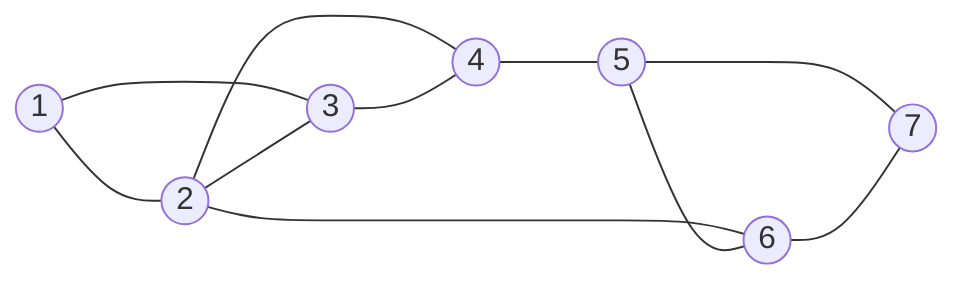

### 有向圖 (directed graph)

邊有方向，只能照箭頭走。這個最好的例子是 Instagram 的追蹤——**你追蹤她，不代表她追蹤你**。這件事在生活中可能有點感傷，但在圖論裡它就只是一條單向的邊。

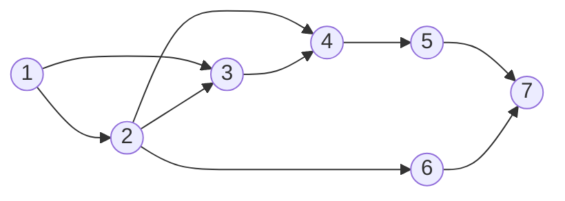

### 加權圖 (weighted graph)

邊上面多一個數字，代表走這條路的「代價」——距離、票價、時間，看題目怎麼定義。下面這張是**加權有向圖**，無向圖當然也可以加權。

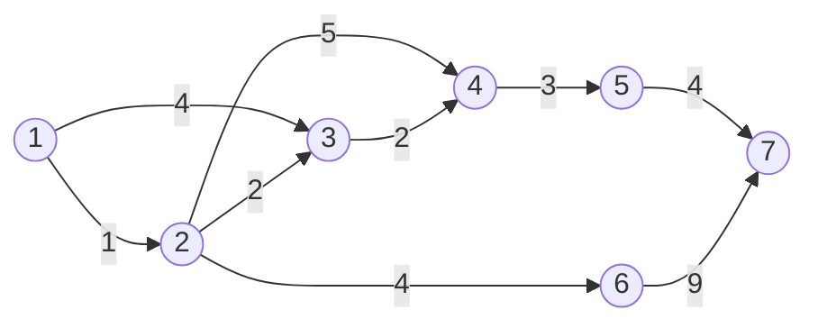

這邊要注意一下：**沒有權重的圖，等於每條邊的權重都是 1。** 這句話現在聽起來像廢話，但它是等一下「為什麼無權圖用 BFS、有權圖要用 Dijkstra」的關鍵，所以先記著。

### 三個之後會遇到的名字

現在不用學，認得就好，看到不要怕：

- **有向無環圖 (DAG, directed acyclic graph)**：有方向，而且你怎麼走都繞不回原點。修課的先修順序、專案的任務相依，都是這種圖。它是拓撲排序的前提。
- **樹 (tree)**：連通且無環的無向圖。老朋友了。
- **二分圖 (bipartite graph)**：節點可以分成兩群，邊只跨群、不在同一群裡面連（例如「學生－課程」）。判斷方法是拿兩種顏色去染，染到衝突就不是。

---

## 第 3 節：度 (degree)

度這個字聽起來很學術，但它的定義非常樸素：

> **度 = 這個點身上插了幾條線。**

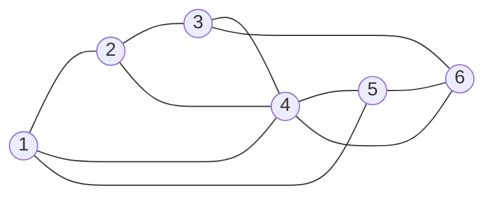

我們把上面這張圖的邊寫成文字，你自己數一次：

```text
1—2   1—4   1—5
2—3   2—4
3—4   3—6
4—5   4—6
5—6
```

節點 4 身上有 `1、2、3、5、6` 五條線 → **度為 5**。
節點 6 身上有 `3、4、5` 三條線 → **度為 3**。

對，就這麼簡單。

### 有方向以後，度要分成兩種

有向圖的邊有箭頭，所以「插了幾條線」要分成進來的跟出去的：

- **出度 (out-degree)**：從這個點**出發**的邊有幾條
- **入度 (in-degree)**：**指向**這個點的邊有幾條

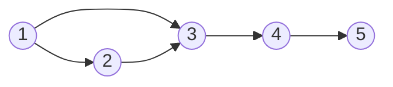

節點 3：兩條邊指向它、一條從它出發 → 入度 2、出度 1。
節點 1：沒有人指向它 → 入度 0、出度 2。

### 那學這個要幹嘛

好問題。度不是拿來考名詞解釋的，它是兩個演算法的開關：
- **拓撲排序**：從**入度為 0** 的節點開始拔。入度 0 是什麼意思？就是「沒有任何前置條件」，可以馬上做的事。lc-210 修課順序就是這樣解的。
- **尤拉路徑**：靠度數的奇偶去判斷路徑存不存在。[lc-332-reconstruct-itinerary](../solutions/15-advanced-graphs/lc-332-reconstruct-itinerary.md) 你已經 AC 過了，它背後就是這件事。

所以度不是裝飾品，它是有工作的。

---

## 第 4 節：連通性 (connectivity)

連通性在問一件事，講白話就是：**「這張圖有沒有斷成好幾塊？」**

### 連通圖 (connected graph)

無向圖裡，任兩個點都走得到彼此，整張圖連成一坨。


有點到不了別人，那就是**非連通圖**。下面這張，節點 1 走不到節點 4：

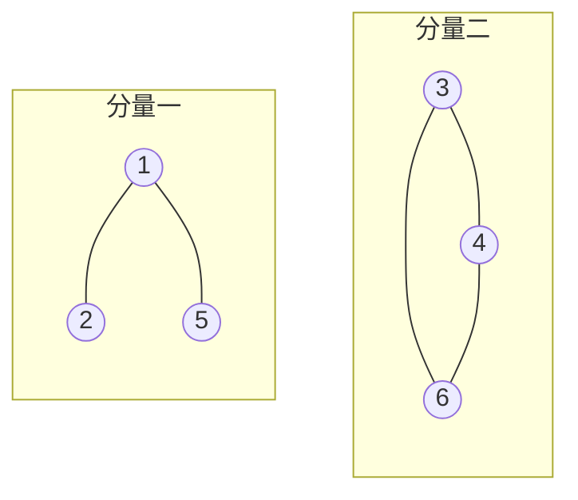

### 強連通圖 (strongly connected graph)

這是有向圖版本的連通，門檻高一點：**任兩點都要能「互相」到達**。

你看下面這張圖，第一眼會覺得「每個點不是都連著嗎」——但它**不是**強連通圖。因為 `1` 到得了 `5`，`5` 卻回不到 `1`。


這張才是。每個點都繞得回來：

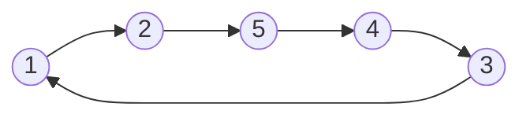

一句話記住這組差別：

> 無向圖問的是「**連不連得到**」；有向圖問的是「**去得了，也回得來嗎**」。

### 連通分量 (connected component)

一張斷掉的圖會分成好幾坨，**每一坨就是一個連通分量**。

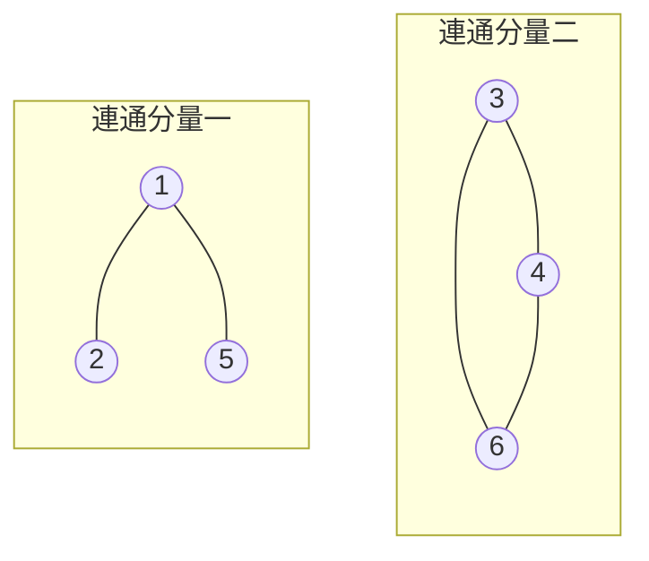

上圖有兩個連通分量：`{1, 2, 5}` 和 `{3, 4, 6}`。

定義裡有個關鍵字叫「**極大**」，很多人卡在這裡。極大的意思不是「最大的那一塊」，而是——

> **這一坨要吃到飽：能拉進來的都要拉進來，拉不動了才停。**

所以 `{3, 4}` 雖然互通，但旁邊還有個 `6` 連著卻沒吃進來，就不算數；一定要 `{3, 4, 6}` 才是一個連通分量。

### 強連通分量 (strongly connected component)

有向圖裡「極大的強連通子圖」。同樣的邏輯，只是把「連得到」換成「互相連得到」。

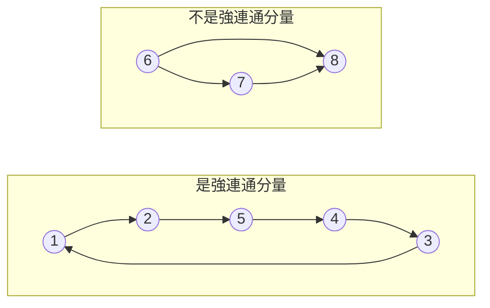

- `{1, 2, 3, 4, 5}` **是**：`1→2→5→4→3→1` 繞得回來，而且已經吃到飽。
- `{6, 7, 8}` **不是**：`8` 回不到 `6`，本身就不強連通。
- `{1, 2, 5}` **不是**：它是強連通沒錯，但還能再變大，不夠極大。

> 專門求強連通分量的演算法（Tarjan、Kosaraju）在後端面試幾乎不會考，你現在知道有這種東西存在就好，不用學。真的問到，你就說「這是 Tarjan 演算法的範疇」，這樣就夠了。

### 講重點：整串島嶼題都是這個

你可能會想，連通分量這種名詞跟我刷題有什麼關係。關係大了。

總表 Graphs 段那一長串島嶼題（lc-200、695、1020、130、827），本質上**全部都是在數連通分量、或量連通分量的大小**：

| 題目在問 | 翻譯成圖論 |
| --- | --- |
| 有幾座島？ | 有幾個連通分量？ |
| 最大的島多大？ | 最大的連通分量有幾個節點？ |
| 有幾個省份／朋友圈？ | 有幾個連通分量？ |

看穿這層翻譯之後你會發現，這五題其實是同一題，只是換了題目敘述。這就是為什麼要先讀理論再刷題——不然你會覺得自己刷了五題，其實你只是把同一題抄了五次。

---

## 第 5 節：圖怎麼存進程式

紙上畫圈圈很好懂，可是程式裡沒有「圈圈」這個型別。所以我們要想辦法把圖變成陣列。有三種做法。

### 存法一：存邊 (edge list)

最直覺的做法——把每條邊記成一列就好。

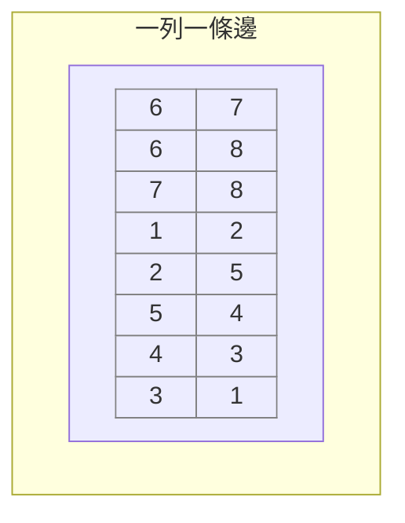

第一列 `6 7` 就是「6 指向 7」。有 `n` 條邊就開 `n × 2` 的陣列。

- **好處**：直觀，人看得懂。
- **致命傷**：你想問「1 和 6 相不相連？」——不好意思，請把整份掃過一遍。

而 DFS/BFS 每走一步都在問「我的鄰居有誰」，每問一次就掃一遍全部的邊，這個複雜度你可以自己想像一下。所以：

> **存邊不是拿來運算的格式，它是拿來「傳資料」的格式。**

LeetCode 很愛丟一個 `int[][] edges` 給你，而你拿到之後的第一個動作，就是把它轉成下面的鄰接表。

### 存法二：鄰接矩陣 (adjacency matrix)

開一個 `n × n` 的二維陣列，`g[i][j]` 記「i 到 j 有沒有邊、權重多少」。

這個東西像什麼？像**班級座位表**——任兩個人之間的關係，你查一格就知道。

|       | **0** | **1** | **2** | **3** | **4** | **5** | **6** | **7** |
| ----- | ----- | ----- | ----- | ----- | ----- | ----- | ----- | ----- |
| **0** | 0     | 0     | 0     | 0     | 0     | 0     | 0     | 0     |
| **1** | 0     | 0     | 0     | 0     | 0     | 0     | 0     | 0     |
| **2** | 0     | 0     | 0     | 0     | 0     | ==6== | 0     | 0     |
| **3** | 0     | 0     | 0     | 0     | 0     | 0     | 0     | 0     |
| **4** | 0     | 0     | 0     | 0     | 0     | 0     | 0     | 0     |
| **5** | 0     | 0     | ==6== | 0     | 0     | 0     | 0     | 0     |
| **6** | 0     | 0     | 0     | 0     | 0     | 0     | 0     | 0     |
| **7** | 0     | 0     | 0     | 0     | 0     | 0     | 0     | 0     |

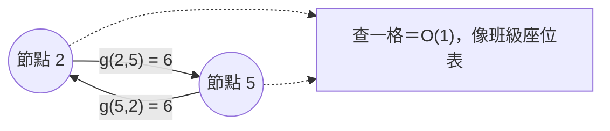

```java
int[][] g = new int[n][n];
g[2][5] = 6;                        // 有向圖：2 → 5，權重 6
g[2][5] = g[5][2] = 6;              // 無向圖：2 與 5 互通，兩格都要寫
```

- **好處**：查「任兩點相不相連」是 `O(1)`，快到不行；圖很**稠密**（邊多到接近 `n²`）的時候很划算。
- **壞處**：圖很**稀疏**的時候慘不忍睹。8 個點只有 5 條邊，你卻開了 64 格，裡面 59 格是 0，全部在浪費。而且你想知道「節點 2 的鄰居有誰」，要掃完一整列 `O(n)`。

### 存法三：鄰接表 (adjacency list)

換個角度想：我不記「誰跟誰的關係」，我只記「**每個點的鄰居名單**」。

這個像什麼？像**通訊錄**——每個人底下列出他認識的人，認識幾個記幾個，不認識的一格都不佔。

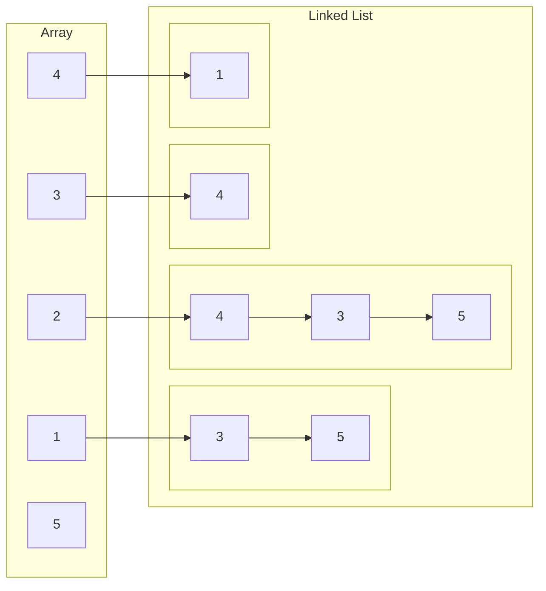

這張圖在講的是：

```text
1 → 3, 5
2 → 4, 3, 5
3 → 4
4 → 1
5 → （沒有出邊）
```

順帶一提，原文寫「陣列 + 鏈結串列」，那是資料結構課本的講法。**你在 Java 裡不用真的去手刻 linked list**，直接用 `List<List<Integer>>` 就好：

```java
List<List<Integer>> g = new ArrayList<>();
for (int i = 0; i < n; i++) g.add(new ArrayList<>());
for (int[] e : edges) {
    g.get(e[0]).add(e[1]);
    g.get(e[1]).add(e[0]);   // 無向圖才加這行；有向圖只留上面那行
}
```

這五行請你練到閉著眼睛都寫得出來，因為之後每一題都要寫一次。

加權圖就把鄰居存成 `int[]{到哪, 權重}`：

```java
List<List<int[]>> g = new ArrayList<>();
g.get(from).add(new int[]{to, weight});
```

- **好處**：有幾條邊就佔多少空間；而且「這個點的鄰居有誰」問一句就拿到——這正好是 DFS/BFS 每一步**唯一**要問的問題。
- **壞處**：查「任兩點相不相連」要掃那個點的鄰居名單。

### 所以到底要用哪個

我知道你想要一個乾脆的答案，我給你：

> **除非題目直接塞給你一個 `n × n` 矩陣，或者明講這是稠密圖，否則一律用鄰接表。**

LeetCode 的圖論題九成以上是稀疏圖。這個選擇你不用每題重想一次。

---

## 第 6 節：LeetCode 的圖，通常不長得像圖

這一節是代碼隨想錄沒有的，因為他用的是卡碼網的 ACM 模式（自己從 stdin 讀資料建圖）。LeetCode 不是這樣玩的。

**在 LeetCode 上，圖會變裝。認出變裝比會寫 DFS 還重要**——你演算法背得再熟，認不出這是圖論題也是零分。

| 題目給你什麼 | 它其實是 | 你的第一個動作 |
| --- | --- | --- |
| `int[][] edges` ＋ `int n` | 存邊 | 轉成鄰接表（上面那五行） |
| `char[][] grid` / `int[][] grid` | **隱式圖**：每個格子是節點，上下左右是邊 | 不用建圖，直接在格子上走 |
| `int[][] isConnected` | 已經是鄰接矩陣了 | 直接用 |
| `String[] words` 之類 | 隱式圖：節點是字串 | 自己定義「什麼算一條邊」（lc-127：只差一個字母） |

### 網格圖 (grid) 是 LeetCode 圖論的最大宗

島嶼系列全部都是網格圖。這裡的心智模型是：**每一格就是一個節點，它的鄰居就是上下左右那四格**。

```text
         (r-1, c)
            ↑
(r, c-1) ← (r, c) → (r, c+1)
            ↓
         (r+1, c)
```

所以方向陣列這個模板，背起來：

```java
private static final int[][] DIRS = {{-1,0},{1,0},{0,-1},{0,1}};  // 上、下、左、右

for (int[] d : DIRS) {
    int nr = r + d[0], nc = c + d[1];
    if (nr < 0 || nr >= m || nc < 0 || nc >= n) continue;  // 先判界，再讀值
    // ...
}
```

> 補一個跨平台的雷：卡碼網的節點編號通常從 1 開始，陣列要開 `n + 1`；LeetCode 幾乎都從 0 開始。你兩邊交替刷的時候，這是最容易吃 runtime error 的地方，而且錯得很冤枉。

---

## 第 7 節：走訪 (traversal)——DFS 跟 BFS

> 這一節只給骨架與最關鍵的判斷。想看逐步演示（DFS 的回溯到底在撤銷什麼、BFS 一圈一圈的圖解與分層寫法），讀 [DFS 基礎篇](T14-02-depth-first-search-basics.md) 與 [BFS 基礎篇](T14-03-breadth-first-search-basics.md)。

好，重頭戲。我們拿這張小圖當例子，等一下兩種走法都用它：

```text
      (1)
      / \
    (2) (3)
     |   |
    (4)—(5)
```

### 深度優先搜尋 (DFS, depth-first search)：一條路走到黑

延伸：[depth-first-search-basics](T14-02-depth-first-search-basics.md)、[depth-first-search](T10-12-depth-first-search.md)

DFS 的行為模式是什麼？就是**走迷宮的時候一律先靠右手邊走，走到死路才退回上一個岔路**。它不管旁邊有沒有別的路，先衝再說。

從 1 出發的順序是：`1 → 2 → 4 → 5 → 3`

你跟著走一次：從 1 先衝去 2，從 2 衝去 4，從 4 衝去 5，5 通到 3，整條走完才回頭。

```java
void dfs(List<List<Integer>> g, int cur, boolean[] visited) {
    visited[cur] = true;              // 一進來就標記
    for (int next : g.get(cur)) {
        if (visited[next]) continue;  // 少了這行，恭喜你，無限迴圈
        dfs(g, next, visited);
    }
}
```

### 廣度優先搜尋 (BFS, breadth-first search)：水波紋往外擴

延伸：[breadth-first-search-basics](T14-03-breadth-first-search-basics.md)、[breadth-first-search](T10-13-breadth-first-search.md)

BFS 完全相反。它像**一滴水掉進池塘**，一圈一圈往外擴：先把「一步到得了」的全部走完，才輪到「兩步到得了」的。

從 1 出發的順序是：`1 → 2, 3 → 4, 5`

```java
Queue<Integer> q = new ArrayDeque<>();
q.offer(start);
visited[start] = true;                // 起點要先標記
while (!q.isEmpty()) {
    int cur = q.poll();
    for (int next : g.get(cur)) {
        if (visited[next]) continue;
        visited[next] = true;         // 入隊當下就標記，不是出隊才標記
        q.offer(next);
    }
}
```

### `visited` 到底存什麼？`cur` 跟 `next` 是同一種東西

這裡有個很多人會卡的地方，我們把它講清楚。看這段 code：

```java
visited[cur] = true;              // cur 出現在「外層 index」的位置
for (int next : g.get(cur)) {
    if (visited[next]) continue;  // next 出現在「內層值」的位置
```

`cur` 和 `next` 一個在外層一個在內層，長得不像同一種東西，為什麼可以用同一個 `visited`？

因為——

> **`g.get(cur)` 裡面那些 Integer 不是「邊」，是「鄰居的節點編號」。**

鄰接表的精髓就在這裡：**外層的 index 和內層的值，用的是同一套編號系統**。

```text
外層 List 的 index  ←── 節點編號
        │
   0 → [1, 2]       ←── 內層的值，也是節點編號
   1 → [0, 3]
   2 → [0]
   3 → [1]
        │
visited[0] visited[1] visited[2] visited[3]   ←── 長度 n，index 也是節點編號
```

像電話簿：第 5 頁寫著「我的朋友是 8 號和 12 號」，而 8 號、12 號本身就是頁碼。`g.get(next)` 能成立，正是因為 `next` 是頁碼。

### 那「邊」跑到哪去了？

**邊在鄰接表裡沒有身份。** 它只是「`cur` 這一列出現了 `next`」這個事實，沒有編號，也沒有地方可以標記。

這不是缺陷，是刻意的——絕大多數圖論題只在乎「節點走過沒」。

但真的有題目要標記**邊**：lc-332 Reconstruct Itinerary，同一張機票只能用一次，那就是在標記邊。那種題不能用 `boolean[] visited` 解決，得另外開 `Map<起點, 每張票用過沒>` 之類的結構。看到題目在管「這條路能不能重複走」而不是「這個點能不能重複到」，就要想起這件事。

### 加權圖是唯一會混淆的地方

```java
List<List<int[]>> g;              // 內層變成 int[]{to, weight}
for (int[] nb : g.get(cur)) {
    int next = nb[0];             // 只有 nb[0] 是節點編號
    if (visited[next]) continue;  // 別拿整個 nb 去索引 visited
}
```

### 我要講第二次：`visited` 的標記時機

這是整篇最容易寫錯的一行，所以我特別拉出來講。

> **BFS 一定要在 `offer` 之前標記，不是等 `poll` 出來才標記。**

為什麼？你想像節點 5 同時是 2 和 3 的鄰居。如果等出隊才標記，那 2 會把 5 塞一次、3 又把 5 塞一次——同一個節點被重複塞進佇列。圖大一點的時候，輕則 TLE，重則記憶體直接爆掉。

這條規則你在 [BFS 主題筆記](T10-13-breadth-first-search.md)（lc-542）自己已經寫過一次了。在樹上它只是個「技巧」，到了圖上它升格成**鐵律**。

### 什麼時候要把 `visited` 還原？

這是圖論最容易混的一組題型。判斷方法只有一句話：

> **先問自己：我是在「數東西」，還是在「列舉東西」？**

| 你在做什麼 | `visited` 怎麼處理 | 代表題 |
| --- | --- | --- |
| 數島嶼、判斷到不到得了 | 走過就**永久**標記，不還原 | lc-200、lc-841 |
| **複製／映射一張圖** | `visited` 不存旗標，**存產物**（old → new 的 clone）；走過就把既有產物**接回去**，不是跳過 | lc-133 |
| 列出**所有**路徑 | 離開節點時要**還原** | lc-797 |

為什麼會有這個差別？

- **數東西**的時候，每個節點只需要被走到一次，走過就結案。這樣每個節點只進去一次，複雜度才會是漂亮的 `O(V + E)`。
- **建東西**的時候，你不只要知道「來過沒」，還要知道「來過，而且我當時做出來的東西是誰」。所以 `boolean[]` 要升級成 `Node[]` 或 `Map<舊, 新>`：碰到走過的節點不能跳過，要把先前那份產物接回去，否則邊會整條消失（[lc-133-clone-graph](../solutions/14-graphs/lc-133-clone-graph.md) 就是這樣錯的）。
- **列舉東西**的時候，同一個節點會出現在很多條不同的路徑上。你不還原，第二條路徑就走不進來了。

一句話收起來：**`visited` 的型別是題目在問什麼決定的。問「幾個」用 `boolean`，問「長什麼樣」就得存值。**

順帶說一句：第二種其實已經不是單純的走訪，它是**回溯**。你在 backtracking 那章練的東西，在這裡會回來找你。

### 為什麼無權圖的最短路一定用 BFS

因為 BFS 是一圈一圈擴散，所以——

> **節點第一次被碰到的那一刻，就是最短步數。**

不可能有更短的了，因為更短的那一圈已經走過了。DFS 就沒有這個保證，它會先衝到底，找到的路徑通常又長又醜。

- 沒有權重 → **BFS**（lc-1926 走迷宮、lc-994 爛橘子、lc-127 單字接龍）
- 有權重 → Dijkstra 那一票專門演算法（後面的章節）

還記得第 2 節那句「無權圖等於每條邊權重都是 1」嗎？就是因為每一步代價一樣，所以「走幾步」才等於「多少代價」，BFS 才會剛好給出最短路。權重一旦不一樣，這個等式就破了，你就得換 Dijkstra。

---

## 第 8 節：複雜度

`V` = 節點數，`E` = 邊數。

| 存法 | DFS／BFS 時間 | 空間 |
| --- | --- | --- |
| 鄰接表 | `O(V + E)` | `O(V)`（`visited` ＋ 遞迴堆疊或佇列） |
| 鄰接矩陣 | `O(V²)` | `O(V²)` 存圖 ＋ `O(V)` |
| 網格圖 `m × n` | `O(m·n)` | `O(m·n)` |

`O(V + E)` 是怎麼來的？很好推：**每個節點只進去一次**（貢獻 `V`）、**每條邊只被看一次**（貢獻 `E`），加起來就是。面試的時候你要能這樣講出來，而不是背一個答案。

---

## 第 9 節：選型——看到什麼，就想到什麼

這張表是整篇的「查表區」，刷到哪一組回來對一次：

| 題目在問 | 用什麼 | 代表題 |
| --- | --- | --- |
| 有幾個群體／島嶼多大 | DFS／BFS 求連通分量，或並查集 | lc-200、695、547 |
| 兩點連不連得到（圖固定不變） | DFS／BFS | lc-1971、841 |
| 兩點連不連得到（邊一條條加進來） | **並查集** | lc-684、1971 |
| 無權圖最少幾步 | BFS | lc-1926、994、127 |
| 有權圖最短路（權重非負） | Dijkstra | lc-743 |
| 有權圖最短路（有負權／限轉乘次數） | Bellman-Ford | lc-787 |
| 任兩點之間的最短路 | Floyd | lc-1334 |
| 修課順序／有向圖有沒有環 | 拓撲排序（從入度 0 開拔） | lc-210 |
| 把所有點連起來的最小成本 | 最小生成樹（Prim／Kruskal） | lc-1584 |
| 列出所有路徑 | DFS ＋ 回溯 | lc-797 |

你會發現總表 Graphs 段的分組跟這張表長得一模一樣。對，那個分組不是隨便排的。

---

## 第 10 節：常見陷阱（都是有人踩過才寫在這裡的）

- **無向圖建圖忘記加反向邊**：只寫 `g.get(a).add(b)`、漏了 `g.get(b).add(a)`。你的圖就悄悄變成有向圖，而且不會報錯，只會答案錯。
- **編號從 1 開始卻只開 `n` 格陣列**：卡碼網常見，要開 `n + 1`。
- **忘記標記起點**：BFS 沒設 `visited[start] = true`，起點會被自己的鄰居再塞一次進來。
- **出隊才標記**：第 7 節講兩次的那個，BFS 的頭號效能地雷。
- **邊界檢查寫在讀值後面**：一定先確認 `nr`、`nc` 在界內，才去讀 `grid[nr][nc]`。順序寫反直接 `ArrayIndexOutOfBoundsException`，而且是那種你 debug 半天才發現的低級錯。
- **遞迴太深爆堆疊**：格子數到 `10^5` 以上（例如一整片連通的大盤面），Java 預設堆疊可能 `StackOverflowError`。這時候改用 BFS，或把 DFS 改成用顯式 stack 的迭代版。
- **重邊與自環**：題目沒保證是簡單圖的時候，`a—a`（自己連自己）跟重複的 `a—b` 都可能出現，並查集跟度數計算要先想清楚。
- **把鄰接表內層的值當成「邊」**：那是鄰居的節點編號,跟外層 index 同一套編號;真正要標記邊的題目(lc-332 機票只能用一次)得另開結構,`boolean[] visited` 不夠用。
- **要建東西卻用「走過就跳過」**：`visited` 只存 boolean 時，第二次碰到同一個節點你就什麼都拿不回來，只能跳過——於是節點都複製出來了，邊卻掉了一半。要建新結構的題目，`visited` 一律存產物本身。
- **產物先遞迴才登記**：一定是「建 clone → 寫進 visited → 才遞迴鄰居」。順序反過來，無向邊本身就是環，遞迴永遠回不來。這跟 BFS「入隊當下標記」是同一條規則。
- **把「走過了」當成「還在這條路上」**：偵測有向圖的環時，這兩件事不一樣。需要三色標記——沒走過／正在走／已走完。這個等你刷到 lc-207 再細講。

---

## 第 11 節：之後會長成什麼（課程地圖）

總表 Graphs 段的後半段。現在只要知道它們存在、大概在解什麼問題就好：

- **並查集 (union-find / disjoint set)**：專門處理「動態把群體合併起來，然後問兩點同不同群」。配上 path compression 之後幾乎是 `O(1)`，很漂亮的資料結構。開刷前一樣先讀理論。
- **拓撲排序 (topological sort)**：在 DAG 上排出一個合法順序，順便偵測有向環。
- **最小生成樹 (minimum spanning tree)**：Prim（從點開始長大）／Kruskal（挑最便宜的邊＋並查集）。
- **最短路徑系列**：Dijkstra、Bellman-Ford、Floyd、A\*。這一系列的差別就在「權重能不能是負的」「要求單源還是全點對」。

---

## 第 12 節：期末自我檢查

我不看你會不會寫 code，我看你會不會講。**能用中文流暢答出這七題，再去動 lc-797 和島嶼系列**：

1. 樹的 DFS 和圖的 DFS 差在哪一行程式碼？為什麼非差不可？
2. 鄰接表和鄰接矩陣各適合什麼情況？LeetCode 預設該用哪個？
3. 給你 `int[][] edges` 和 `int n`，五行內寫出建鄰接表的程式碼。
4. BFS 的 `visited` 為什麼一定要在入隊時標記？出隊才標記會發生什麼具體後果？
5. 「數島嶼」和「列出所有路徑」在 `visited` 的處理上差在哪？為什麼？
6. 為什麼無權圖的最短路要用 BFS 而不是 DFS？有權重之後為什麼就不行了？
7. `g.get(cur)` 拿到的那串 Integer 是什麼？為什麼 `cur` 和 `next` 可以共用同一個 `visited`？

答不出來的那題，回去看對應的那一節就好，不用整篇重讀。

---

## 已刷題目

- [133. Clone Graph](../solutions/14-graphs/lc-133-clone-graph.md) Medium — 第一次踩到「樹不用 visited、圖一定要」，並學到 `visited` 可以存產物而不只是旗標。
- [733. Flood Fill](../solutions/14-graphs/lc-733-flood-fill.md) Easy — 網格圖上的連通分量填色，圖論的最小案例。
- [797. All Paths From Source to Target](../solutions/14-graphs/lc-797-all-paths-from-source-to-target.md) Medium — DAG 上列舉所有路徑；實際驗證了「列舉題不能用永久 visited」，而且 DAG 連還原式標記都不用。

## 相關

- [_index](_index.md) — 主題筆記索引（含兩篇制規則）
- [_moc](../_moc.md)
- [刷題規劃：§12 Graph Theory](../_moc.md)
- [DFS](T10-12-depth-first-search.md)、[BFS](T10-13-breadth-first-search.md)、[Binary Tree](T10-21-binary-tree.md)、[Matrix](T01-11-matrix.md)
- [複雜度分析](T00-01-complexity-analysis.md)

---

## 附錄 A：名詞中英對照

| 中文 | English | 備註 |
| --- | --- | --- |
| 節點 | vertex（複數 vertices）／node | 面試講 `V` 個 vertices |
| 邊 | edge | `E` 條 edges |
| 有向圖 | directed graph | 邊有方向 |
| 無向圖 | undirected graph | 邊沒方向 |
| 加權圖 | weighted graph | 邊帶權重 |
| 有向無環圖 | DAG (directed acyclic graph) | 拓撲排序的前提 |
| 二分圖 | bipartite graph | 染色法判定 |
| 度 | degree | 無向圖用 |
| 入度／出度 | in-degree / out-degree | 有向圖用 |
| 連通圖 | connected graph | 無向圖用 |
| 強連通圖 | strongly connected graph | 有向圖用 |
| 連通分量 | connected component | 島嶼題在數的東西 |
| 強連通分量 | strongly connected component | 有向圖版 |
| 環 | cycle | 無環有向圖＝DAG |
| 存邊 | edge list | LeetCode 常見的輸入格式 |
| 鄰接矩陣 | adjacency matrix | `n × n` 二維陣列 |
| 鄰接表 | adjacency list | 每點一份鄰居名單 |
| 走訪 | traversal | DFS／BFS 的統稱 |
| 深度優先搜尋 | DFS (depth-first search) | 一條路走到黑 |
| 廣度優先搜尋 | BFS (breadth-first search) | 一圈一圈擴散 |
| 並查集 | union-find / disjoint set | 動態合併群體 |
| 拓撲排序 | topological sort | 排出合法順序 |
| 最小生成樹 | MST (minimum spanning tree) | Prim／Kruskal |
| 最短路徑 | shortest path | Dijkstra／Bellman-Ford／Floyd |
